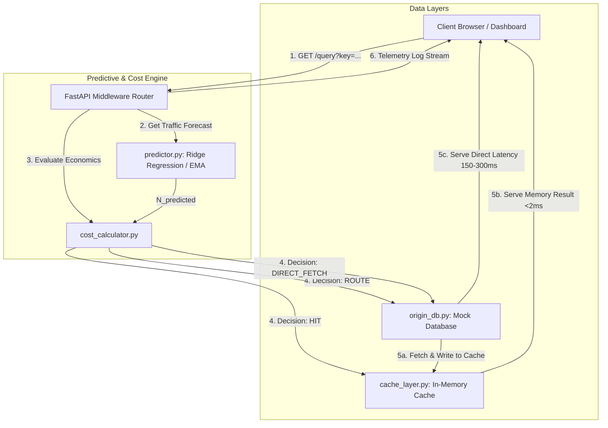

# Predictive Cloud-Cost Caching Engine

An intelligent, cloud-economics middleware proxy that evaluates unit economics ($Cost_{cache}$ vs $Cost_{fetch}$) using predictive traffic analytics to dynamically decide whether to serve query results from an in-memory cache or query the origin database.

Built as a high-performance FastAPI backend with a scikit-learn forecasting engine, integrated with a responsive glassmorphic dark-mode web console.

---

## 🏗️ Architectural Overview



---

## 📈 Cloud Unit Economics Formulas

The engine continuously evaluates two competing options over a sliding forecast window of **60 seconds**:

### 1. Direct Database Fetch Cost ($Cost_{fetch}$)
Every database query incurs compute cost and network egress charges (dependent on payload size):
$$Cost_{fetch\_total} = N_{predicted} \times \left( P_{compute} + \left[ S \times P_{egress} \right] \right)$$
* Where:
  * $N_{predicted}$: Forecasted request count for the key in the next 60s.
  * $P_{compute}$: Database execution charge per query.
  * $S$: Result size in Kilobytes (KB).
  * $P_{egress}$: Network egress charge per KB.

### 2. Cache Route Cost ($Cost_{cache}$)
Caching requires writing the item once to cache on miss (paying database fetch + cache write cost), storing the entry in memory, and reading it virtually for free:
$$Cost_{cache\_total} = \left( P_{compute} + \left[ S \times P_{egress} \right] \right) + P_{write} + \left( S \times P_{storage} \right) + \left( N_{predicted} - 1 \right) \times P_{read}$$
* Where:
  * $P_{write}$: Cache API call cost per write.
  * $P_{storage}$: In-memory cache storage price per KB per window.
  * $P_{read}$: Cache API read cost (negligible, set to $0.000001).

### 3. Decision Matrix
* If $Cost_{cache\_total} < Cost_{fetch\_total}$ $\rightarrow$ **CACHE_ROUTED** (write on miss) or **CACHE_HIT** (read on hit).
* If $Cost_{cache\_total} \ge Cost_{fetch\_total}$ $\rightarrow$ **DIRECT_FETCH** (always query database, bypass and evict cache).

---

## 🚀 Quick Start

### 1. Setup Dependencies
Ensure you have Python 3.11+ installed. Run:
```powershell
pip install -r requirements.txt
```

### 2. Launch the Engine
Start the FastAPI server:
```powershell
python -m uvicorn app.main:app --reload
```
The server will bind to `http://localhost:8000`.

### 3. Access the Dashboard
Open your web browser and navigate to:
[http://localhost:8000](http://localhost:8000)

---

## 🧪 Testing the Engine
The project contains automated tests verifying unit behavior, predictive logic, and boundary switches.

To run tests:
```powershell
pytest
```

---

## ⚙️ Key Dataset & Caching Behavior
The mock database provides five items with varying frequencies and sizes to demonstrate boundary decisions:

| Key | Mock Size (S) | Request Probability | Normal Caching Policy |
| :--- | :--- | :--- | :--- |
| `image_metadata` | 5 KB | 20% | **Always Cache** (Tiny size, low storage overhead) |
| `user_profile` | 10 KB | 60% | **Always Cache** (High frequency, high cumulative DB cost) |
| `search_products` | 150 KB | 12% | **Dynamic** (Sensitive to storage/compute sliders) |
| `recommendations_feed` | 800 KB | 6% | **Dynamic** (Sensitive to storage/compute sliders) |
| `analytics_report` | 5000 KB | 2% | **Bypass** (Large size, storage cost exceeds DB compute savings) |
